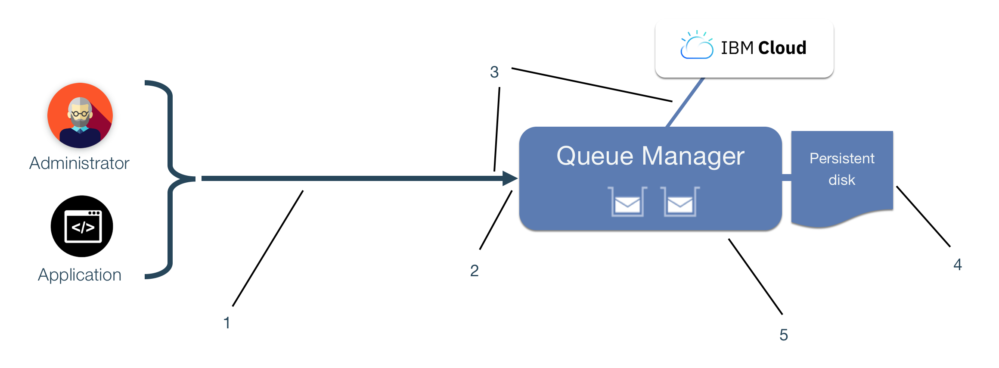

---
copyright:
  years: 2018
lastupdated: "2018-02-20"
---

{:new_window: target="_blank"}
{:shortdesc: .shortdesc}
{:screen: .screen}
{:codeblock: .codeblock}
{:pre: .pre}

# MQ on IBM Cloud Security
{: #index}

Learn about the security features provided with MQ on IBM Cloud.

{:shortdesc}

## Default Security Features

1. MQ channels provide the option to encrypt data in transit from applications and administrators using TLS connections. There is some configuration for the customer to apply to enable the TLS capability
2. A default TLS server certificate is configured for the queue manager signed by a public Certificate Authority such as DigiCert
3. Queue manager channels are configured by default with username/password authentication, which is backed by the IBM Cloud Identity and Access Management (IAM) for user and application management
4. All persisted queue manager data including messages, configuration and logs, is encrypted at rest using full disk encryption on storage volumes.
5. IBM MQ provides extensive features for providing fine grained access control to specific resources such as queues/topics within the queue manager, which can be leveraged in the same way as for on-premises customer deployments

## Default MQ Security Configuration

### Users

To provide administrative access to queue managers in a service instance, a user must be added to the "User permissions" list by following the steps provided [here](/docs/services/mqcloud/tutorials/tut_mqoc_configure_admin_qm_access.html).

Any user with administrative access has the capability to view and modify any MQ configuration and to write and access message data. For these reasons, administrative access should be limited wherever possible.

By giving a user permissions they become a member of the `mqm` group for each queue manager in that service instance.

By default MQ "BLOCKUSER" rules are defined so members of `mqm` group can only connect to the queue manager using the `CLOUD.ADMIN.SVRCONN` channel. To connect using other channels an authentication record needs to be added as described [here](https://www.ibm.com/support/knowledgecenter/SSFKSJ_9.0.0/com.ibm.mq.sec.doc/q010250_.htm).

### Applications

To enable an application to connect and interact with any of the queue managers in a service instance, an application must first be added to the "Application permissions" list by following the steps provided [here](/docs/services/mqcloud/tutorials/tut_mqoc_configure_admin_qm_access.html).

The MQ username and API key that are generated when creating the application permission are to be used as the username and password when connecting applications to MQ.
By default, each application that you add has the following authorization:
-	To connect to a queue manager (with Connect or Inquire authority)
-	Put, get and browse messages on any queues and topics that start with "DEV.", for example the pre-defined ones you'll find on the queue managers.

By default MQ "BLOCKUSER" rules are defined so applications can only connect to the queue manager using the `CLOUD.APP.SVRCONN` channel. To connect using other channels an authentication record needs to be added as described [here](https://www.ibm.com/support/knowledgecenter/SSFKSJ_9.0.0/com.ibm.mq.sec.doc/q010250_.htm).

#### Creating New Queues and Topics

When defining new queues or topics to be used by applications, by default no application will have authority to access them. First you must create an authority record to grant an application access to any new resources. To do this, use the MQ username generated when the application permission was defined when creating the authority record.  

See the following [topic](https://www.ibm.com/support/knowledgecenter/SS5K6E_9.0.0/com.ibm.mq.mqc.doc/q127740_.htm) for details on creating authority records.

#### Connecting Client Applications

Client applications connecting using IBM MQ client libraries below version 8.0.0.0 will be unable to supply user credentials to the queue manager and so will be unable to connect.

Java and JMS applications have two different methods of supplying credentials to a queue manager that is controlled by a switch called `compatibility mode`. You must ensure that when the Java or JMS application is connecting it is supplying user credentials with compatibility mode disabled.  For details on configuring your client application see steps provided [here](/docs/services/mqcloud/mqoc_common_problems.html#mqoc_jms_user_id_solution)

## Recommendations

It is strongly recommended to use TLS channels for administration and application connectivity in order to protect credentials and business data, as it flows between the application and the queue manager. For details on configuring TLS for channels please see the following [topic](https://www.ibm.com/support/knowledgecenter/SSFKSJ_9.0.0/com.ibm.mq.explorer.doc/e_ssl.htm) in the IBM Knowledge Center.

MQ on IBM Cloud does not currently offer the Advanced Messaging Security (AMS) feature, which provides a higher level of protection for sensitive data. It is therefore suggested that sensitive data should be encrypted, in your message payloads, to ensure that it is fully protected as it flows through the system.

The queue manager source IP address is dynamic and will change if a queue manager is restarted or fails over to another host. The source IP address is shared by multiple queue managers and therefore should not be used as the only mechanism for authenticating an incoming connection on a receiver channel.

## The MQ details

If you're interested in the exact configuration of a queue manager, read on.

Two channels are provided by default:
- `CLOUD.ADMIN.SVRCONN` for use by Administrator users, for example connecting using MQ Explorer or runmqsc
- `CLOUD.APP.SVRCONN`  for applications connecting to send and receive messages

Both channels transmit data using non-TLS connections by default but it is recommended to enable TLS encryption as described in the Recommendations section above. Additional configuration must be carried out to allow tools such as MQ Explorer to establish a connection to an encrypted channel.

Incoming connections to the two pre-defined channels are blocked by default - to enable access follow the steps described for Users or Applications.

Incoming connection requests for channels other than the two names defined above are blocked by a default "ADDRESSMAP" rule. This means that if you define your own MQ channel (for example to accept incoming connections from another queue manager) then connection to that new channel will be blocked by default and you will need to define a rule to permit the specific connection to that new channel.

For details on configuring MQ fine grained authorization please see the following [topic](https://www.ibm.com/support/knowledgecenter/SSFKSJ_9.0.0/com.ibm.mq.sec.doc/q013480_.htm) in the IBM Knowledge Center.
