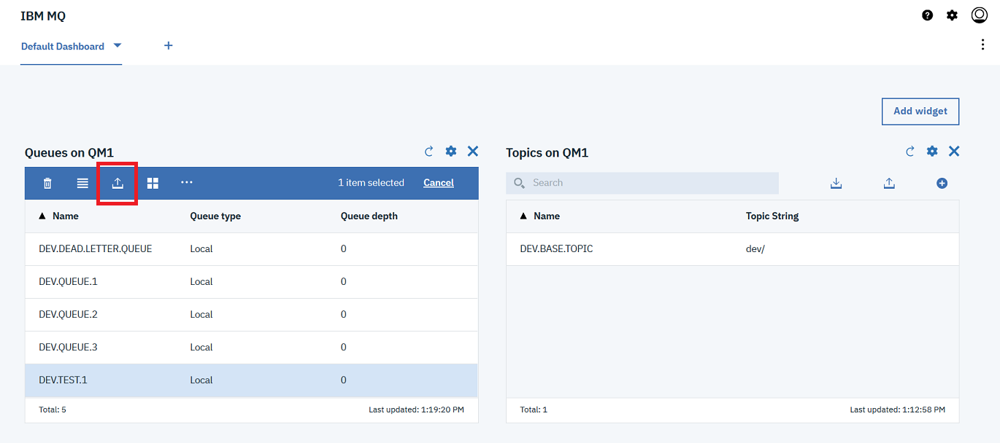
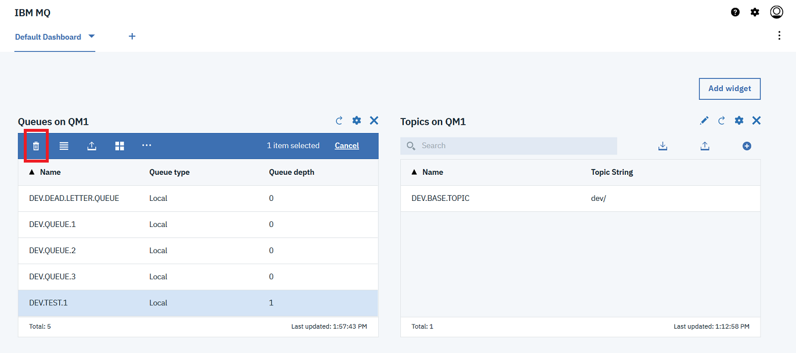

---
copyright:
  years: 2017, 2018
lastupdated: "2018-02-09"
---

{:new_window: target="_blank"}
{:shortdesc: .shortdesc}
{:screen: .screen}
{:codeblock: .codeblock}
{:pre: .pre}

# Administering a queue manager using IBM MQ Web Console
{: #mqoc_admin_mqweb}

With the MQ Web Console, you can create a new queue, put a message onto the queue, browse the queue to view the message, and delete the queue.
{:shortdesc}

---

## Prerequisites
{: #prereq_mqoc_admin_mqweb}

* An existing queue manager (for instructions, follow the [creating a queue manager](mqoc_create_qm.html) guide).
* You have been granted permissions to access queue managers within your IBM MQ service instance. You have obtained your MQ username and have created your platform API key (for instructions, follow the [configuring administrator access for a queue manager](tutorials/tut_mqoc_configure_admin_qm_access.html) guide).

---

## Login to the IBM Web Console for your queue manager
{: #connect_mqoc_admin_mqweb}

1. Log in to the IBM Cloud console.
2. Click on the 'hamburger menu'.
3. Click **Dashboard**.
4. Locate and click on your IBM MQ service instance, found under the 'Services' heading.
  * Ensure that **RESOURCE GROUP** is set to **All Resources** and **REGION** is set to **US South Region**.
5. From the list of your queue managers, click on the one you want to administer.
6. Click **Administer**.
7. Click **Launch MQ Console**, this will open the 'IBM MQ Web Console' in a new browser tab.
8. Type your **MQ username** into the 'User Name' text box.
9. Paste your **platform API key** into the 'Password' text box.
10. Click **Login** and you're ready to go.

---

## Create a new test queue.
{: #createq_mqoc_admin_mqweb}

In the 'Queues on ...' widget:

1. Click the **'+'** symbol.

 

2. Type in 'DEV.TEST.1'.
  * Note the name can contain up to 48 characters. Valid characters are letters, numbers and the period, forward slash, underscore and percent symbols.
  * The queue name needs to be unique within the queue manager.
3. Select a queue type of 'Local'.
4. Click **Create**.

Your new queue now appears in the list.

---

## Put a message onto the test queue
{: #put_mqoc_admin_mqweb}

1. Click queue 'DEV.TEST.1'.
2. Click on the 'Letter' ('Put message') symbol.

 

3. Type in a test message.
4. Click **Put**.

You can see that the 'Queue depth' for 'DEV.TEST.1' is now **1**.

---

## Browse a message on the test queue
{: #get_mqoc_admin_mqweb}

1. Click queue 'DEV.TEST.1'.
2. Click the 'Open folder' ('Browse messages') symbol.

 

3. Confirm you can see your test message and then click **Close**.

---

## Delete the test queue
{: #deleteq_mqoc_admin_mqweb}

1. Click on queue 'DEV.TEST.1'.
2. Click on the 'Trash can' ('Delete') symbol.

 

3. Click **Clear queue**.
4. Click **Delete**.

You can see that the test queue has been removed from the list of queues.

---

## Conclusion
{: #conc_mqoc_admin_mqweb}

You've successfully:
* Connected to a queue manager using the IBM MQ Web Console and have created a new test queue
* Put a test message onto the test queue and have browsed the test queue to view the test message
* Cleared and deleted the test queue to clean up

---

## Next step
{: #next_mqoc_admin_mqweb}

Please see [Administration using the IBM MQ Console](https://www.ibm.com/support/knowledgecenter/en/SSFKSJ_9.0.0/com.ibm.mq.adm.doc/q127570_.htm) for more information on what you can do with IBM Web Console.

[Connecting an application to a queue manager](/docs/services/mqcloud/mqoc_connect_app_qm.html)
