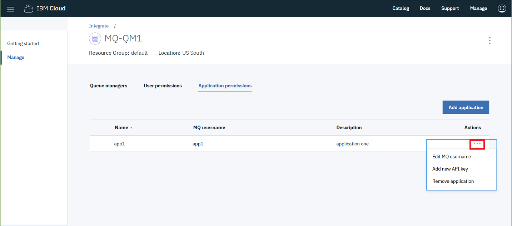

---
copyright:
  years: 2017, 2018
lastupdated: "2018-02-07"
---

{:new_window: target="_blank"}
{:shortdesc: .shortdesc}
{:screen: .screen}
{:codeblock: .codeblock}
{:pre: .pre}

# Editing the MQ username for an existing application
{: #mqoc_edit_app_username}

These instructions will **edit** the MQ username for an existing application.
  * **Warning:** your application will no longer be able to connect to queue managers with the original MQ username.

1. Log in to the IBM Cloud console.
2. Click on the 'hamburger menu'.
3. Click **Dashboard**.
4. Locate and click on your IBM MQ service instance, found under the 'Services' heading.
  * Ensure that **RESOURCE GROUP** is set to **All Resources** and **REGION** is set to **US South Region**.
5. Click the **Application permissions** tab.
6. Click the **Actions** menu **...** for the application's entry in the list of Application permissions.

 

7. Click **Edit MQ username**.
8. Enter a new MQ username.
  * Note: the MQ username must have a maximum of 12 characters and be lower case a-z or 0-9.  It must also be unique within your IBM MQ service instance.
9. Click **Save**.
